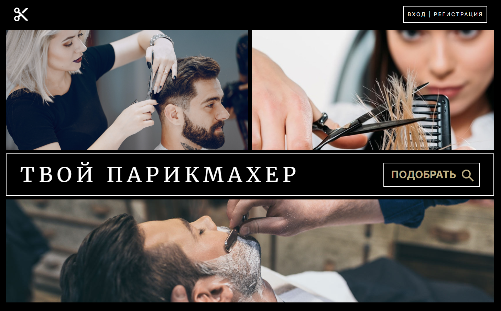

# Твой парикмахер

**Разработчик:** Дмитрий Бандысик 

Веб-приложение "Твой парикмахер" создано в рамках курса "Разработчик веб-приложений на Python" от IT-Academy (Гродно).

### Идея проекта
У веб-приложения **две** основных идеи:

**1. Для пользователей**  
Поиск парикмахеров / барберов в нужном регионе и с нужными навыками.

**2. Для парикмахеров / барберов**  
Создание портфолио с указанием местонахождения, навыков, контактных и прочих данных. Доступна загрузка изображений выполненных работ (до 20 фото).

### Основные доступные функции
* ```Регистрация / Авторизация``` - пользователи могут создавать свои учетные записи, что позволит пользоваться всем доступным функционалом веб-приложения.
* ```Создание портфолио парикмахера``` - любой зарегестрированный пользователь может создать своё уникальное портфолио парикмахера, которое будет отображаться в общем поиске парикмахеров.
* ```Система поиска``` - всем пользователям доступна функция поиска парикмахеров / барберов в зависимости от местоположения и требуемых навыков.
* ```Система рейтинга``` - зарегестрированные пользователи могут оценивать мастеров и оставлять комментарии, что в будущем позволит им находить самых лучших мастеров.
***
